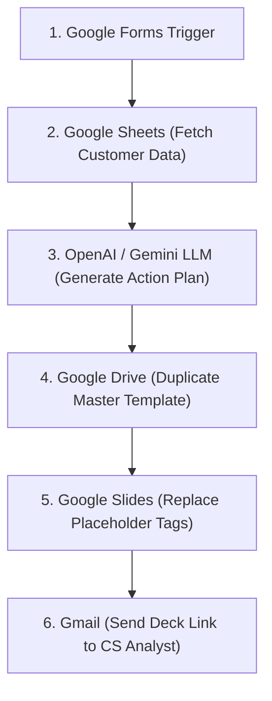

As an **n8n Expert**, I have architected an end-to-end automated workflow to generate personalized Strategic Alignment presentations for Customer Success Analysts using AI.

---

### 🗺️ Workflow Architecture



---

### 🧩 Recommended n8n Nodes & Operational Logic

#### Node 1: **Google Forms Trigger** (or Google Sheets Trigger)
* **Node Type:** `n8n-nodes-base.googleFormsTrigger` / `n8n-nodes-base.googleSheetsTrigger`
* **Purpose:** Triggers immediately when a CS Analyst submits a request form.
* **Output Data:** Captures `clientID` and `csAnalystEmail`.

#### Node 2: **Google Sheets** (Lookup Customer Usage Data)
* **Node Type:** `n8n-nodes-base.googleSheets`
* **Operation:** `Read / Get Many` (with Filter / Lookup)
* **Logic:** Searches the Customer Database sheet where `ID == {{ $json.clientID }}`.
* **Output Data:** Customer Name, Contracted Modules, Active Modules, Unused Modules, Platform Logins, Engagement Score.

#### Node 3: **OpenAI / Google Gemini** (AI Action Plan Generation)
* **Node Type:** `n8n-nodes-langchain.chainLlm` or `n8n-nodes-base.openAi`
* **Operation:** `Generate Message / Text`
* **Logic:** Analyzes adoption gaps (contracted vs. used modules) and outputs a structured JSON action plan.
* **Recommended Prompt Template:**
  ```text
  You are an expert Customer Success Strategist. Analyze this client data:
  Client Name: {{ $json.customerName }}
  Contracted Modules: {{ $json.contractedModules }}
  Used Modules: {{ $json.usedModules }}
  Engagement Score: {{ $json.engagementScore }}

  Generate a tailored 3-part strategic action plan:
  1. Key Successes (Modules with high usage).
  2. Adoption Opportunities (Contracted modules currently unused).
  3. Action Steps (3 actionable steps to increase platform engagement).

  Return ONLY a raw JSON object with keys: "strengths", "opportunities", "action_steps".
  ```

#### Node 4: **Google Drive** (Duplicate Master Slide Template)
* **Node Type:** `n8n-nodes-base.googleDrive`
* **Operation:** `File / Copy`
* **Logic:** Keeps your Master Template untouched while creating a clean copy for this specific client.
* **Parameters:**
  * **File ID:** Master Template Presentation ID.
  * **Name:** `[Strategic Alignment] {{ $node["Google Sheets"].json.customerName }} - {{ $today.format('yyyy-MM') }}`
* **Output Data:** `id` of the newly created presentation copy.

#### Node 5: **Google Slides** (Replace Placeholder Text)
* **Node Type:** `n8n-nodes-base.googleSlides` (or HTTP Request to Google Slides API `batchUpdate`)
* **Operation:** `Presentation / Replace Text`
* **Logic:** Replaces predefined text placeholders in the copied slides with live data.
* **Field Mapping:**
  * `{{CLIENT_NAME}}` ➔ `{{ $node["Google Sheets"].json.customerName }}`
  * `{{STRENGTHS}}` ➔ `{{ $node["OpenAI"].json.strengths }}`
  * `{{OPPORTUNITIES}}` ➔ `{{ $node["OpenAI"].json.opportunities }}`
  * `{{ACTION_STEPS}}` ➔ `{{ $node["OpenAI"].json.action_steps }}`

#### Node 6: **Gmail** (Notify CS Analyst)
* **Node Type:** `n8n-nodes-base.gmail`
* **Operation:** `Send Message`
* **Logic:** Delivers the finalized presentation link directly to the requesting CS Analyst.
* **Parameters:**
  * **To:** `{{ $node["Google Forms Trigger"].json.csAnalystEmail }}`
  * **Subject:** `🚀 Strategic Alignment Deck Ready: {{ $node["Google Sheets"].json.customerName }}`
  * **Body (HTML):**
    ```html
    <p>Hi CS Team,</p>
    <p>The strategic alignment deck for <strong>{{ $node["Google Sheets"].json.customerName }}</strong> has been generated with custom AI insights.</p>
    <p><a href="https://docs.google.com/presentation/d/{{ $node["Google Drive"].json.id }}/edit">👉 Access Google Slides Deck Here</a></p>
    ```

---

### 💡 Pro-Tips for Production Setup

1. **JSON Structured Output:** Enforce JSON Mode in OpenAI/Gemini to ensure predictable keys for mapping directly into Google Slides.
2. **Master Slide Tagging:** Format placeholder tags (e.g. `{{CLIENT_NAME}}`) directly in Google Slides with your desired font, color, and size. Google Slides API preserves formatting when replacing text.
3. **Error Handling:** Attach an **Error Trigger Node** to send a alert email to the CS team if the customer ID is not found or if an API rate-limit occurs.
