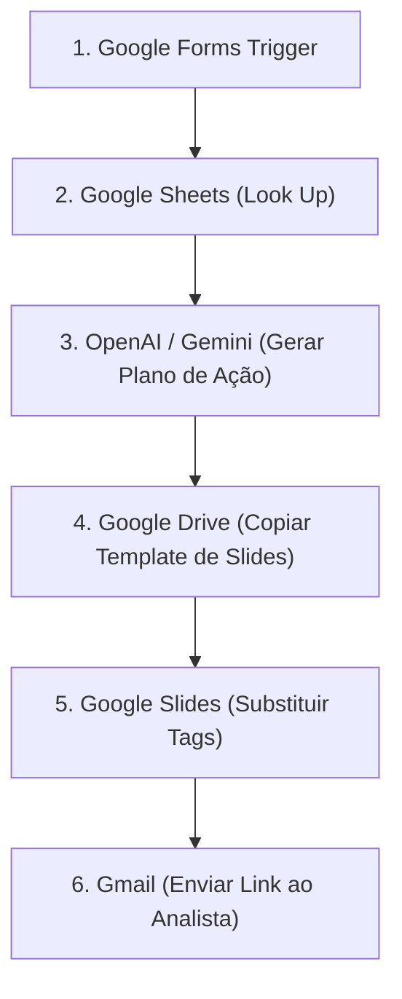

Olá! Como especialista em **n8n**, montei uma arquitetura completa para essa automação de Sucesso do Cliente (CS). 

Essa solução vai automatizar a criação de **Decks de Alinhamento Estratégico** 100% personalizados usando IA, economizando horas de trabalho braçal do Analista de CS.

---

### 🗺️ Arquitetura do Workflow (Diagrama)



---

### 🧩 Detalhamento dos Nós do n8n e Lógica de Funcionamento

#### 1. **Google Forms Trigger** (ou Google Sheets Trigger)
* **Função:** Iniciar a automação assim que o Analista de CS preencher o formulário.
* **Configuração:**
  * Conecte ao formulário ou à planilha de respostas do formulário.
  * **Variáveis capturadas:** `ID_Cliente` e `Email_Analista`.

#### 2. **Google Sheets** (Nó de Busca de Dados)
* **Função:** Buscar os dados de módulos e usabilidade do cliente na planilha mestra.
* **Operação:** `Read / Get Many` ou `Look up rows`.
* **Configuração:**
  * **Filtro:** `ID do Cliente` é igual a `{{ $json.ID_Cliente }}` vindo do nó 1.
* **Saída dos dados:** Nome do Cliente, Módulos Contratados, Módulos Utilizados, Score de Engajamento, Data da Última Ação, etc.

#### 3. **OpenAI / Google Gemini** (Nó de Inteligência Artificial)
* **Função:** Analisar a discrepância entre o que foi contratado x utilizado e gerar o plano de ação personalizado.
* **Operação:** `Message / Generate Text`.
* **Prompt Engineering Recomendado:**
  > *"Você é um especialista em Customer Success. Analise o cliente **{{ $json.Nome_Cliente }}**.*
  > *Módulos Contratados: **{{ $json.Modulos_Contratados }}***
  > *Módulos Efetivamente Utilizados: **{{ $json.Modulos_Utilizados }}***
  > *Engajamento Geral: **{{ $json.Score_Engajamento }}***
  >
  > *Gere um plano de ação estratégico com 3 pilares:*
  > 1. *O que o cliente está fazendo de excelente (pontos fortes).*
  > 2. *Oportunidade de adoção (módulos contratados e não utilizados).*
  > 3. *Próximos passos práticos para aumentar o engajamento.*
  > 
  > *Responda no formato JSON com as chaves: `ponto_forte`, `oportunidade`, `proximos_passos`."*

#### 4. **Google Drive** (Nó de Duplicação do Template)
* **Função:** Manter o seu arquivo "Template Master" intacto e criar uma cópia nova para esse cliente específico.
* **Operação:** `File / Copy`.
* **Configuração:**
  * **File ID:** O ID do seu modelo padrão no Google Slides.
  * **Name (Novo Nome):** `[Alinhamento Estratégico] {{ $json.Nome_Cliente }} - {{ $today.format('yyyy-MM') }}`
  * **Parent Folder:** Escolha a pasta do Google Drive onde as apresentações geradas serão salvas.
* **Saída:** O `id` do **novo arquivo de apresentação** gerado.

#### 5. **Google Slides** (Nó de Personalização dos Slides)
* **Função:** Substituir as "tags coringa" do modelo padrão pelas informações do cliente e pelo plano de ação gerado pela IA.
* **Operação:** `Presentation / Replace Text` (ou requisição na Google Slides API).
* **Tags no seu Template Master:**
  * Defina textos como `{{NOME_CLIENTE}}`, `{{ANALISTA_CS}}`, `{{PONTO_FORTE}}`, `{{OPORTUNIDADE}}`, `{{PROXIMOS_PASSOS}}` nos seus slides.
* **Configuração no n8n:**
  * Mapeie cada tag para o valor correspondente gerado pelos nós anteriores:
    * `{{NOME_CLIENTE}}` ➔ `{{ $node["Google Sheets"].json.Nome_Cliente }}`
    * `{{PONTO_FORTE}}` ➔ `{{ $node["OpenAI"].json.ponto_forte }}`
    * `{{OPORTUNIDADE}}` ➔ `{{ $node["OpenAI"].json.oportunidade }}`
    * `{{PROXIMOS_PASSOS}}` ➔ `{{ $node["OpenAI"].json.proximos_passos }}`

#### 6. **Gmail** (Nó de Notificação)
* **Função:** Enviar o link da apresentação pronta diretamente para o e-mail do Analista de CS.
* **Operação:** `Send Email`.
* **Configuração:**
  * **To:** `{{ $node["Google Forms Trigger"].json.Email_Analista }}`
  * **Subject:** `🚀 Apresentação Pronta: Alinhamento Estratégico - {{ $node["Google Sheets"].json.Nome_Cliente }}`
  * **Body (HTML):**
    ```html
    <p>Olá, Analista!</p>
    <p>A apresentação de Alinhamento Estratégico do cliente <strong>{{ $node["Google Sheets"].json.Nome_Cliente }}</strong> foi gerada com sucesso pela IA.</p>
    <p><a href="https://docs.google.com/presentation/d/{{ $node["Google Drive"].json.id }}/edit">Clique aqui para acessar o Google Slides</a></p>
    ```

---

### 💡 Boas Práticas do Especialista n8n

1. **Uso de JSON Estruturado na IA:** Configure o nó da IA para responder em formato JSON (Structured Outputs ou JSON Mode). Isso garante que o texto venha separado em partes certinhas para colocar em slides diferentes.
2. **Tags de Texto no Google Slides:** No seu modelo de slide, formate o texto (tamanho da fonte, cor, negrito) das tags `{{NOME_CLIENTE}}`. O Google Slides substitui o texto mantendo a formatação exata que você definiu na tag.
3. **Tratamento de Erros:** Adicione um nó de **Error Trigger** no final do fluxo. Se a planilha não encontrar o ID do cliente ou a API da OpenAI oscilar, o Analista recebe um e-mail informando que o processo falhou.

Essa estrutura é extremamente robusta, escalável e 100% automatizada! O que achou do desenho desse fluxo?
