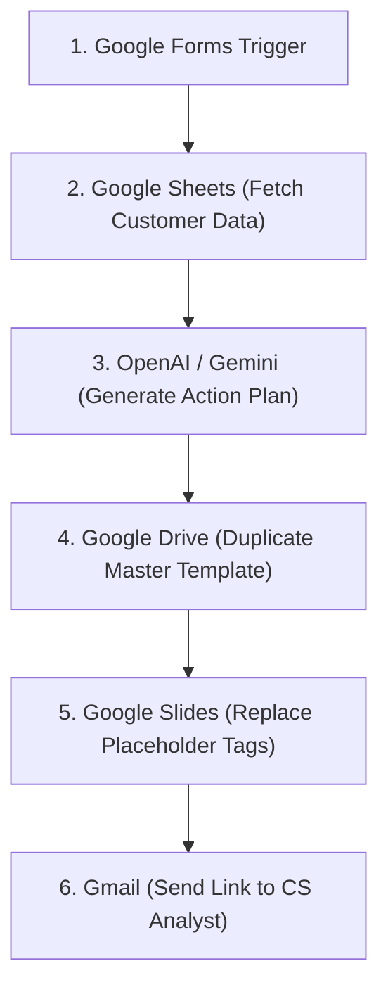

# n8n AI Strategic Alignment Presentation Generator 🚀

An automated **n8n workflow** designed for **Customer Success (CS) Analysts** that generates personalized, AI-driven strategic alignment presentations in Google Slides based on customer usage data, contracted modules, and engagement metrics.

---

## 📌 Project Purpose

Manual creation of QBR (Quarterly Business Review) or Strategic Alignment decks takes hours of data gathering and slide formatting. This automation streamlines the entire process:

1. Triggers upon Google Forms submission with a **Customer ID** and **CS Analyst Email**.
2. Fetches customer account data and product usage metrics from a **Google Sheets** database.
3. Leverages **AI (OpenAI / Gemini)** to analyze adoption gaps and generate a customized action plan.
4. Duplicates a master **Google Slides** template and replaces placeholder tags with tailored insights.
5. Sends the finalized Google Slides presentation link directly to the CS Analyst via **Gmail**.

---

## 🏗️ Workflow Architecture

---

## 🛠️ Tools & Integrations

- **[n8n](https://n8n.io/)**: Workflow automation engine.
- **Google Forms**: Entry point for CS Analysts to request a presentation.
- **Google Sheets**: Database containing customer module contracts and usage metrics.
- **OpenAI / Google Gemini**: AI engine generating tailored strategic action plans.
- **Google Drive**: Manages presentation templates and output storage.
- **Google Slides**: Renders the personalized customer deck.
- **Gmail**: Delivers notification emails with the slide deck link.

---

## 📋 Prerequisites & Setup

### 1. Google Workspace Credentials
- Enable **Google Sheets API**, **Google Drive API**, and **Google Slides API** in Google Cloud Console.
- Configure OAuth2 credentials in n8n for Google services.

### 2. OpenAI / Gemini API Key
- Add your OpenAI or Gemini API key under n8n Credentials.

### 3. Google Slides Master Template
Create a master presentation template with placeholder tags in your slides:
- `{{NOME_CLIENTE}}` - Customer Name
- `{{PONTO_FORTE}}` - Current Strengths / High Adoption
- `{{OPORTUNIDADE}}` - Unused Contracted Modules
- `{{PROXIMOS_PASSOS}}` - AI Recommended Action Plan

---

## 📥 How to Import into n8n

1. Download or copy the `workflow.json` file from this repository.
2. Open your **n8n instance**.
3. Click **Workflows** > **Import from File** (or paste the JSON directly).
4. Connect your Google and OpenAI credentials to the respective nodes.
5. Activate the workflow!

---

## 📜 License

This project is licensed under the MIT License - feel free to adapt and expand for your CS team!
